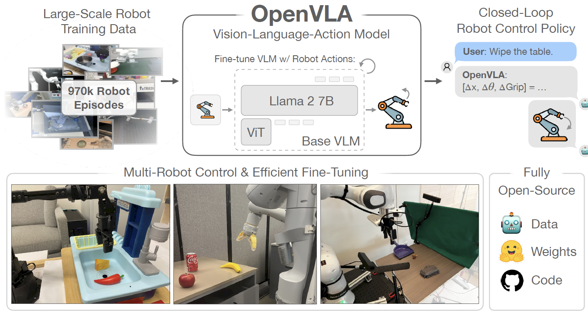

    <h1>Awesome Embodied Multimodal LLMs   (Vison-Language-Action Models)</h1>
    
    

This is a collection of research papers about Embodied Multimodal Large Language Models (VLA models).

If you would like to include your paper or update any details (e.g., code urls, conference information), please feel free to submit a pull request or email me. Any advice is also welcome.

## Table of Contents
- [Awesome-Embodied-Multimodal-LLMs](#Awesome-Embodied-Multimodal-LLMs)
  - [Overview](#Overview-of-Embodied-Multimodal-LLMs)
  - [Models](#Models)
  - [Datasets & Benchmark](#Datasets-&-Benchmark)

## Overview

Embodied Multimodal LLMs integrate vision information and action outputs into large language models (LLMs). Leveraging the rich knowledge and strong reasoning capabilities of LLMs, these models excel in interactively following human instructions, comprehensively understanding the real world, and effectively conducting various embodied tasks. They hold great potential to achieve Artificial General Intelligence (AGI).

## Models

| Title                                                        |                        Introduction                         |    Date    |                             Code                             |
| :----------------------------------------------------------- | :---------------------------------------------------------: | :--------: | :----------------------------------------------------------: |
|   [OpenVLA: An Open-Source Vision-Language-Action Model](https://arxiv.org/abs/2406.09246) |      | 2024-06-13 |         [Github](https://github.com/openvla/openvla)         |
|   [A3VLM: Actionable Articulation-Aware Vision Language Model](https://arxiv.org/abs/2406.07549) |        | 2024-06-11 |        [Github](https://github.com/changhaonan/A3VLM)        |
|  [Embodied CoT Distillation From LLM To Off-the-shelf Agents](https://openreview.net/pdf?id=M4Htd52HMH) |        | 2024-05-02 |                              -                               |
|  [RoboMP$^2$: A Robotic Multimodal Perception-Planning Framework with Multimodal Large Language Models](https://arxiv.org/abs/2404.04929) |      | 2024-04-07 |                              -                               |
|   [3D-VLA: A 3D Vision-Language-Action Generative World Model](https://arxiv.org/abs/2403.09631) |        | 2024-03-14 |  [Github](https://github.com/UMass-Foundation-Model/3D-VLA)  |
|   [ShapeLLM: Universal 3D Object Understanding for Embodied Interaction](https://arxiv.org/abs/2402.17766) |     | 2024-02-27 |        [Github](https://github.com/qizekun/ShapeLLM)         |
|  [NaVid: Video-based VLM Plans the Next Step for Vision-and-Language Navigation](https://arxiv.org/abs/2402.15852) |        | 2024-02-24 |                              -                               |
|   [MultiPLY: A Multisensory Object-Centric Embodied Large Language Model in 3D World](https://arxiv.org/abs/2401.08577) |     | 2024-01-16 | [Github](https://github.com/UMass-Foundation-Model/MultiPLY) |
|   [ManipLLM: Embodied Multimodal Large Language Model for Object-Centric Robotic Manipulation](https://arxiv.org/abs/2312.16217) |     | 2023-12-24 |       [Github](https://github.com/clorislili/ManipLLM)       |
|   [MP5: A Multi-modal Open-ended Embodied System in Minecraft via Active Perception](https://arxiv.org/abs/2312.07472) |          | 2023-12-12 |           [Github](https://github.com/IranQin/MP5)           |
|   [Towards Learning a Generalist Model for Embodied Navigation](https://arxiv.org/abs/2312.02010) |      | 2023-12-04 |         [Github](https://github.com/zd11024/NaviLLM)         |
|   [LL3DA: Visual Interactive Instruction Tuning for Omni-3D Understanding, Reasoning, and Planning](https://arxiv.org/abs/2311.18651) |        | 2023-11-30 |          [Github](https://github.com/Open3DA/LL3DA)          |
|   [An Embodied Generalist Agent in 3D World](https://arxiv.org/abs/2311.12871) |          | 2023-11-18 |      [Github](https://github.com/IST-DASLab/sparsegpt)       |
|   [Large Language Models as Generalizable Policies for Embodied Tasks](https://arxiv.org/abs/2310.17722) |        | 2023-10-26 |         [Github](https://github.com/apple/ml-llarp)          |
|  [RT-2: Vision-Language-Action Models Transfer Web Knowledge to Robotic Control](https://arxiv.org/abs/2307.15818) |          | 2023-07-28 |                              -                               |
|   [Building Cooperative Embodied Agents Modularly with Large Language Models](https://arxiv.org/abs/2307.02485) |        | 2023-07-05 | [Github](https://github.com/UMass-Foundation-Model/Co-LLM-Agents) |
|   [EmbodiedGPT: Vision-Language Pre-Training via Embodied Chain of Thought](https://arxiv.org/abs/2305.15021) |  | 2023-05-24 | [Github](https://github.com/EmbodiedGPT/EmbodiedGPT_Pytorch) |
|  [PaLM-E: An Embodied Multimodal Language Model](https://arxiv.org/abs/2303.03378) |        | 2023-03-06 |                              -                               |

## Datasets & Benchmark

| Title                                                        |                         Introduction                         |    Date    |                           Code                           |
| :----------------------------------------------------------- | :----------------------------------------------------------: | :--------: | :------------------------------------------------------: |
|   [OpenEQA: Embodied Question Answering in the Era of Foundation Models](https://openaccess.thecvf.com/content/CVPR2024/papers/Majumdar_OpenEQA_Embodied_Question_Answering_in_the_Era_of_Foundation_Models_CVPR_2024_paper.pdf) |       | 2024-06-17 |  [Github](https://github.com/facebookresearch/open-eqa)  |
|   [PhyScene: Physically Interactable 3D Scene Synthesis for Embodied AI](https://arxiv.org/pdf/2404.09465) |        | 2024-04-15 | [Github](https://github.com/PhyScene/PhyScene/tree/main) |
|   [EmbodiedScan: A Holistic Multi-Modal 3D Perception Suite Towards Embodied AI](https://arxiv.org/abs/2312.16170) |  | 2023-12-26 |  [Github](https://github.com/OpenRobotLab/EmbodiedScan)  |
|   [Holodeck: Language Guided Generation of 3D Embodied AI Environments](https://arxiv.org/abs/2312.09067) |      | 2023-12-14 |      [Github](https://github.com/allenai/Holodeck)       |
|  [Learning Interactive Real-World Simulators](https://arxiv.org/abs/2310.06114) |        | 2023-10-09 |                            -                             |
|   [Towards End-to-End Embodied Decision Making via Multi-modal Large Language Model: Explorations with GPT4-Vision and Beyond](https://arxiv.org/abs/2310.02071) |      | 2023-10-3  |    [Github](https://github.com/pkunlp-icler/PCA-EVAL)    |

